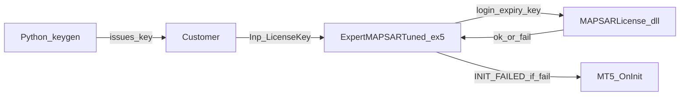

# MAPSAR commercial license (key + C++ DLL)

## Goal
Ship one `.ex5` + `MAPSARLicense.dll`. You mint per-customer license keys offline. Live MT5 refuses to init without a valid key bound to account login (+ expiry). No paid protector.

## Defaults (locked in)
- **Bind:** `ACCOUNT_LOGIN` only (not server — fewer false fails across broker renames)
- **Algo:** HMAC-SHA256 over `login|expiry_yyyy_mm_dd`, key = URL-safe Base64(`payload`) + `.` + URL-safe Base64(`mac`)
- **Tester:** skip license check when `MQLInfoInteger(MQL_TESTER)` (your backtests stay easy)
- **Live / demo chart:** key required
- **Scope v1:** validate-only in DLL (trading logic stays in MQL5). Can move hot logic later.
- **Secret:** compile-time in DLL + `mt5/license/secret.local` (gitignored) for keygen



## Layout

| Path | Role |
|------|------|
| [`mt5/license/dll/`](mt5/license/dll/) | CMake + `MAPSARLicense.cpp` / `.h` → `MAPSARLicense.dll` (x64) |
| [`mt5/license/keygen/keygen.py`](mt5/license/keygen/keygen.py) | CLI: `--login` `--expiry` → prints key |
| [`mt5/license/README.md`](mt5/license/README.md) | Build, deploy, enable “Allow DLL imports” |
| [`mt5/Include/ExpertMAPSAR/LicenseGate.mqh`](mt5/Include/ExpertMAPSAR/LicenseGate.mqh) | `#import` wrapper + `LicenseOk()` |
| [`mt5/Experts/ExpertMAPSARTuned.mq5`](mt5/Experts/ExpertMAPSARTuned.mq5) | Input + early `OnInit` gate |

## DLL API (MQL5-friendly)

```cpp
extern "C" __declspec(dllexport)
int MAPSAR_ValidateLicense(
   const wchar_t* key,
   long long account_login,
   long long now_unix   // EA passes TimeGMT()
);
// return 1 = ok, 0 = bad/expired/mismatch
```

Use `wchar_t*` / document string conversion: from MQL5 pass `string` via `#import` with `string` mapped carefully — prefer **ANSI/UTF-8 `char*`** exports to avoid wchar import pitfalls:

```cpp
int MAPSAR_ValidateLicense(const char* key, long long account_login, long long now_unix);
```

EA converts with `StringToCharArray`.

## EA wiring

In [`ExpertMAPSARTuned.mq5`](mt5/Experts/ExpertMAPSARTuned.mq5):

- Add input group `=== License ===`
  - `Inp_LicenseKey` (string)
- At top of `OnInit`, before expert init:

```mql5
if(!LicenseOk(Inp_LicenseKey))
  {
   Print("ERROR: License invalid or missing. Enable Allow DLL imports and set Inp_LicenseKey.");
   return(INIT_FAILED);
  }
```

[`LicenseGate.mqh`](mt5/Include/ExpertMAPSAR/LicenseGate.mqh):

```mql5
#import "MAPSARLicense.dll"
int MAPSAR_ValidateLicense(char& key[], long long account_login, long long now_unix);
#import

bool LicenseOk(const string key)
  {
   if(MQLInfoInteger(MQL_TESTER))
      return(true);
   // char array + AccountInfoInteger(ACCOUNT_LOGIN) + TimeGMT()
  }
```

Bump `#property version` (e.g. 1.23).

## Keygen

```bash
python keygen.py --login 12345678 --expiry 2027-01-01
# reads secret from secret.local or LICENSE_SECRET env
```

Same HMAC + Base64 rules as DLL (document byte-for-byte in README).

## Build / deploy notes (README)

1. Build DLL with CMake + MSVC x64 (or clang-cl); output `MAPSARLicense.dll`
2. Copy to `{MT5}/MQL5/Libraries/`
3. Recompile EA in MetaEditor
4. EA properties: **Allow DLL imports** = true
5. Set `Inp_LicenseKey` for the client account

Add `mt5/license/secret.local` and `*.dll` to `.gitignore` if not already.

## Out of scope (v1)
- Moving signal/MG logic into the DLL
- Server online activation / phone-home
- Code signing (recommend later for AV; note in README)
- macOS / Wine MT5 support
